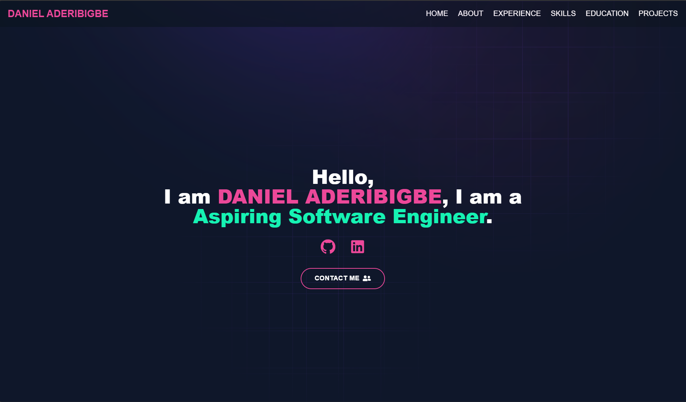

# Daniel Aderibigbe – Portfolio

My personal developer portfolio built with **React, TypeScript, Tailwind CSS, and Vite**.  
Showcasing my skills, experience, and projects.

🌐 **Live Site**: [dan2clouted.com](https://dan2clouted.com)

---

## 🚀 Tech Stack

- React + TypeScript
- Tailwind CSS
- Vite
- Cloudflare Pages (hosting)

---

## 📂 Sections

- **Hero** – Intro with socials
- **About Me** – Background and goals
- **Experience** – Work & freelance history
- **Skills** – Tools & languages
- **Education** – T-Levels and GCSEs
- **Projects** – Showcasing apps I built
- **Contact** – Email form + links

---

## 📸 Screenshots



---

## 📌 How to Run Locally

```bash
git clone https://github.com/<your-username>/<repo-name>.git
cd <repo-name>
npm install
npm run dev
```
